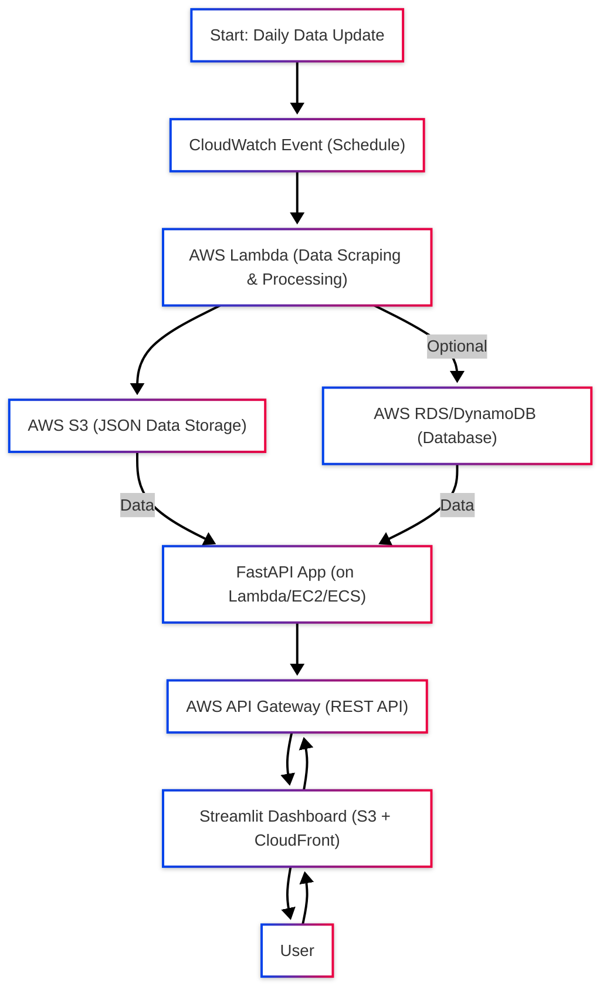

 

<h1 align="center"><strong> Real-Estate Daily Investment Insights Agent :<h6 align="center">AI-powered agentic system for investing in new Real estate </h6></strong></h1>

# Real Estate Property Analysis Agent

The Real Estate Property Analysis System is an automated data pipeline designed to collect, process, and analyze property listings from popular Indian real estate websites. This project combines web crawling, data extraction, and AI-powered analysis to provide valuable insights for property investors and buyers.

### Key Features
- **Automated Data Collection**: Daily crawling of real estate sites for new properties
- **Intelligent Data Extraction**: Structured property data extraction using AI
- **Interactive Dashboard**: Visual exploration of property trends and statistics
- **Investment Analysis**: AI-powered recommendations for property investment
- **API Access**: RESTful API endpoints for programmatic data access
- **Scheduled Execution**: Fully automated workflow with Prefect orchestration

The system is designed to be maintainable, extensible, and robust, with proper error handling and monitoring capabilities.

## System Architecture Overview

This flowchart provides a visual overview of the real estate property analysis system architecture, showing how data flows from web crawling to analysis and presentation.

## System Architecture

### 1. Orchestration
The scheduler.py file controls the entire workflow using Prefect for robust task scheduling and management. Tasks run daily at 1 AM in sequence.

### 2. Data Collection
- Web crawlers for Housing.com and MagicBricks.com
- Uses Playwright for browser automation
- Site-specific interaction hooks handle navigation and filtering

### 3. Data Processing
- Extracts structured property data from raw markdown
- Normalizes and standardizes data (locations, prices, areas)
- Caches processed data to improve efficiency

### 4. Data Storage
- Raw scraped data stored as markdown files
- Processed data stored in JSON format for easy consumption

### 5. API Layer
- FastAPI server provides programmatic access to property data
- Endpoints for property listings, statistics, and system health

### 6. Analysis & Visualization
- Streamlit dashboard for interactive data exploration
- Location-based analysis with map visualization
- AI-powered investment analysis using OpenAI

### 7. External Dependencies
- OpenAI API for data extraction and analysis
- Playwright for web automation

This architecture provides a complete end-to-end pipeline from data collection to analysis and presentation, with both UI and API access to the processed data.

## Streamlit Dashboard

